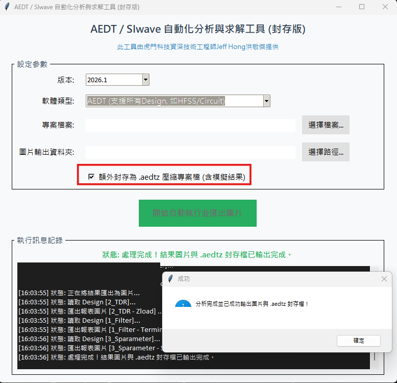
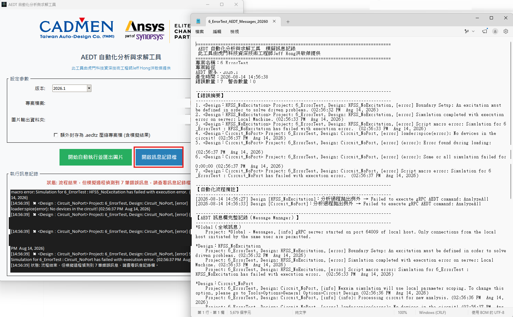

# AEDT／SIwave 自動化分析與求解服務

本專案提供 Ansys Electronics Desktop（AEDT）與 SIwave 的自動化分析、求解流程整合與客製化工具開發服務。

## 可協助的工作

- AEDT 電路、HFSS、Q3D 與 SIwave 自動化流程。
- 多工具串接與批次求解。
- 模擬結果整理與報表輸出。
- 專案封裝、路徑管理與結果檢查。
- 模擬錯誤訊息的擷取、保存與追查。
- 依客戶流程開發專用 GUI、腳本或執行工具。

## 模擬錯誤訊息記錄

批次自動化求解最常見的困擾，是流程跑完才發現某個設計沒有解出來，卻已無從追查原因。這件事有兩個成因：

- Circuit（Nexxim）設計的求解 Log 位於 AEDT 的暫存目錄，AEDT 關閉時會連同暫存目錄一併刪除。
- HFSS 求解 Log 的內容來源是 Solution Profile，其用途為記錄求解流程與資源耗用狀況，最終僅以一行狀態表示求解失敗，本質上不包含錯誤原因；真正指出問題點的訊息只存在於 AEDT 訊息欄（Message Manager），且同樣會隨 AEDT 關閉而消失。

因此工具會在釋放 License、關閉 AEDT **之前**，先擷取訊息欄的 Global、Project 與各 Design 三個層級的完整內容，連同原生求解 Log 與求解狀態摘要一併寫入獨立記錄檔。該檔案不隨 AEDT 關閉而消失，可供執行人員事後追查。

記錄檔以錯誤摘要置頂，並依所屬設計分組；流程結束時若偵測到錯誤，介面會明確提示錯誤筆數，不會一律顯示為執行成功。

## 商業服務說明

本專案屬於客製化商業服務，完整腳本、執行檔、專案整合與技術支援需依需求評估及報價，公開 Repository 不提供實際程式碼。

本 Repository 僅提供服務說明，不包含任何腳本、執行檔、客戶模型、模擬結果或操作影片。

服務範圍與洽詢方式另見 [服務說明](服務說明.md)。

## 實際操作畫面

以下為封存版自動化分析與求解工具的實際操作畫面，展示參數設定、結果圖片輸出與 AEDT 封存檔產生流程。

下圖為模擬錯誤訊息記錄功能的實際畫面。左側為工具主畫面，狀態列明確提示本次偵測到的錯誤筆數，執行訊息框逐筆列出錯誤內容；右側為工具產生的記錄檔，錯誤摘要置頂並依所屬設計分組，可直接看出是哪一個設計、因為什麼原因求解失敗。

> 畫面中的專案路徑等本機資訊已為公開展示而遮蔽。

## 聯絡洽詢

如有需求請聯絡洽詢，建議提供 Ansys／SIwave 版本、目前流程、預期功能、輸入輸出格式及預計時程。

---

本 Repository 為 Jeff Hong 個人技術作品集之公開展示內容，非 Taiwan Auto-Design Co.（TADC，虎門科技）官方帳號，亦非 Ansys, Inc. 官方合作項目；Ansys、HFSS、SIwave 為 Ansys, Inc. 之商標。原始碼與內容僅供技術展示，未經授權不得商業使用、散布或製作衍生作品，詳見 [LICENSE](LICENSE)。如需授權或合作，請洽 jeff.hong@cadmen.com。
